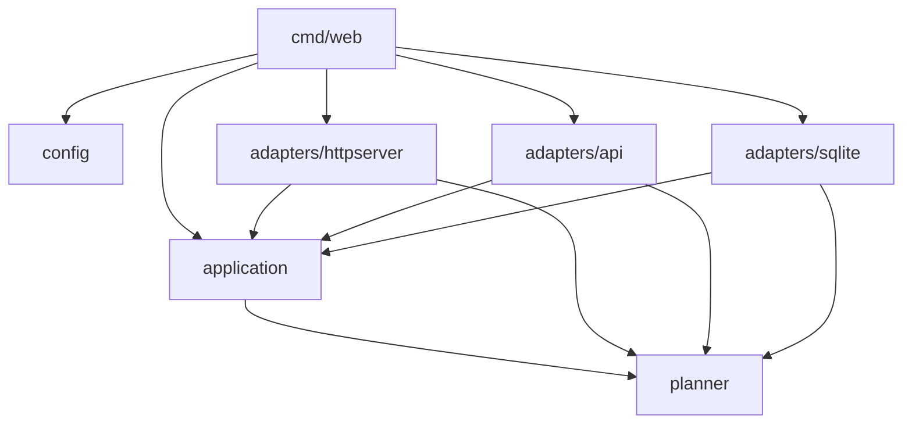

# Package structure

Command entry points live in `cmd/`; reusable application code is private to this module under
`internal/`. Templates and static assets remain in `views/` and `public/`, relative to the process
working directory. Run the commands from the repository root, as before.

| Package | Responsibility | Internal dependencies |
|---|---|---|
| `internal/planner` | Trip types, ranking, grouping, scheduling, geometry and stay selection | None |
| `internal/application` | Weather/video report services, trip service, destination identity/photo and city guide contracts, shared models and ports | `planner` |
| `internal/config` | Environment and `.env` configuration | None |
| `internal/adapters/api` | External HTTP provider clients, including Wikimedia (places and destination photos), Open-Meteo and Overpass | `application`, `planner` |
| `internal/adapters/httpserver` | Fiber routes, sessions, HTML/HTMX rendering and request analytics | `application`, `planner` |
| `internal/adapters/sqlite` | Database lifecycle, city/source caching, visit persistence and queries | `application`, `planner` |
| `internal/placetypes` | Offline Wikimedia collection, classification rules and Go map generation | `adapters/api`, `planner` |
| `internal/slug` | The `city-country` slug format (`Build`/`Parse`) shared by `/trip/:slug` URLs and `guides/guides.json` keys | None |
| `internal/guides` | Offline Wikivoyage collection, a local Ollama call and generation of `guides/guides.json`, plus `Book`, the in-memory reader that serves only reviewed entries as `application.CityGuideSource` | `application`, `slug`, `adapters/api` (Wikivoyage client user agent) |
| `weatherservice/guides` (package `guidedata`) | Embeds `guides/guides.json` in the web binary | None |



`application.Storage` is the dashboard's persistence interface. `sqlite.Open(path)` returns a
store that implements it. Each store owns its connection, and `Store.Close()` releases it.
The store's `NewCachedPlaceSource`, `NewCachedForecastSource`, `NewCachedStaySource` and
`NewCachedDestinationPhotoSource` methods wrap sources using that same connection. There is no production package-global database.

Application services and planner logic do not import adapters. The HTTP adapter does not open
databases or construct provider clients. `cmd/web` loads configuration, opens storage, constructs
providers and passes them to services and handlers. `cmd/loadtest-server` follows the same
wiring with fixture reporters. `cmd/placetypes` handles flags and calls `placetypes.Run`.
`cmd/guides` is a separate command: it talks to Wikivoyage and a local Ollama server and writes
`guides/guides.json`. The web server never runs it. It reads the reviewed result: `cmd/web`
parses the embedded file into a `guides.Book` and hands it to `Server.SetCityGuideSource`, the
same wiring style as the photo source. The HTTP adapter sees only `application.CityGuideSource`,
so it does not import `internal/guides` or reach a provider.

`internal/adapters/httpserver` also holds shareable-link and export code: `slug.go`
(`Slug`/`ParseSlug`, thin wrappers over `internal/slug` for the `city-country` `/trip/:slug` path segment), `export_ics.go`/
`export_kml.go` (the `.ics`/`.kml` routes), `googlemaps.go` (the per-day walking-directions
link), `sitemap.go` (`/sitemap.xml`, built from cached cities only) and `ratelimit.go` (caps how
many never-before-seen cities `/trip/:slug` will plan per minute). `sitemap.go` reads and writes
its slug list through `Storage.ListSitemapSlugs`/`RecordSitemapSlug`; the SQLite store keeps one
row per slug in `sitemap_slugs`, so sitemap generation never calls a provider.

## Presentation and assets

`index.go.tpl` owns the document shell and calls `content_fragment.go.tpl` for the destination
body. Search requests render that same fragment. `plan_response.go.tpl` replaces the trip form
and uses out-of-band HTMX swaps for the itinerary and stays. All four section anchors exist
before a plan is generated.

`presentation.go` decorates HTTP views from an embedded image manifest. Images live in
`public/images/`; destination matching includes city and country, and optional stay imagery
also requires an unambiguous property identity. Decoration does not alter provider/domain types
or cached JSON. The production Docker image includes templates and public assets.

**Destination photos** follow the same boundaries as the planner sources.
`application.DestinationPhotoSource` (`internal/application/destinationphoto.go`) takes a
`DestinationIdentity` (resolved name, ISO country, coordinates) and returns an attributed
`DestinationPhoto`, `(nil, nil)` for a completed lookup with no suitable image, or an error.
`api.DestinationPhotoAPI` implements it over Wikidata and Commons without a key, and
`Store.NewCachedDestinationPhotoSource` wraps it with an identity-validating cache in
`source_cache`. `cmd/web` builds both and calls `Server.SetDestinationPhotoSource`; a nil source
is valid, as in fixtures that have none. In the HTTP adapter (`destinationphoto.go`), one
`destinationPresentation` builder serves the initial page, the HTMX fragment and the shared trip
page. It starts the lookup as soon as the destination resolves, in parallel with the cache read
and video request, and always waits for it before rendering, so a response can only carry its own
destination's photo. A curated manifest photo (Lisbon) overrides the lookup. Page-cache hits are
accepted only when `sameDestination` agrees on name, country and coordinates within
`application.DestinationMatchKM`, so a cached Paris, Texas never stands in for Paris, France.
The template renders an explicit "Photo unavailable" state, and an image load failure switches the
figure to it through `data-photo-state`, hiding the orphaned credit and caption.

**City guides** are decided in the same builder. `application.CityGuideSource.Guide(city, country)`
answers from memory: `guides.Book`, built once at startup from the embedded `guides/guides.json`,
keeps only entries that are `reviewed`, with a Wikivoyage title, a positive revision, a valid
`YYYY-MM-DD` review date and a non-empty intro (`Entry.Publishable`). A lookup is by the `city-country`
slug of the *resolved* destination (`internal/slug`), so a namesake in another country, a local
spelling or a country given as a name gets nothing rather than a neighbour's text. Serving a
request never calls Ollama, generates text or touches the network. `destinationPresentation`
puts a `guideView` on `.Presentation.Guide` for the initial page, the HTMX fragment and the shared
trip page alike: either the reviewed paragraphs with their Wikivoyage article, revision, history
and CC BY-SA links, or an explicit "no reviewed guide yet" state. A source that returns a guide
without a title or revision is treated as no guide, because the attribution is a condition of
showing the text. The template (`views/guide_card.go.tpl`) escapes all of it.

The [design reference](design.md) records template inputs, the planner response contract and
style boundaries. The [credential-free preview](../tasks/redesign/preview.md) exercises real routes
and templates. See [verification results](../tasks/project-fix-results.md) for tested behavior
and [maintenance notes](maintenance.md) for remaining work.

Tests live with their packages. HTTP integration tests use a temporary SQLite store and real
root templates; source and city fixtures remain next to their packages.

## Verification

```sh
make test
make lint
make build
docker build -t traveltab .

# Optional live checks retain their explicit opt-in.
LIVE_API_TESTS=1 go test -run Live ./internal/adapters/api/
RECORD_FIXTURES=1 go test -run Cities ./internal/planner/
```

`go run ./cmd/placetypes` now writes `internal/planner/placetypes_gen.go` by default.
