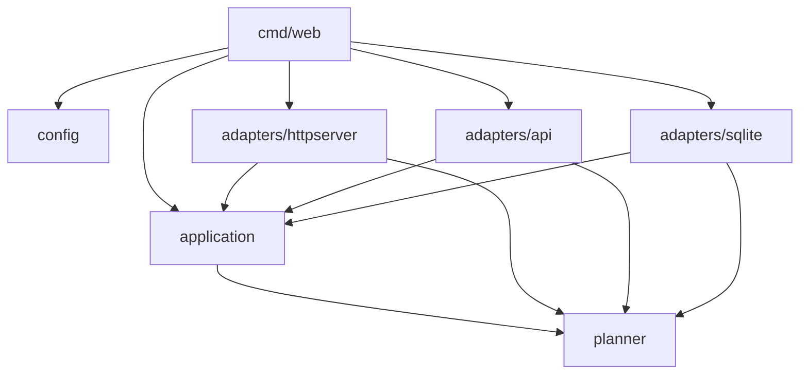

# Package structure

Command entry points live in `cmd/`; reusable application code is private to this module under
`internal/`. Templates and static assets remain in `views/` and `public/`, relative to the process
working directory. Run the commands from the repository root, as before.

| Package | Responsibility | Internal dependencies |
|---|---|---|
| `internal/planner` | Trip types, ranking, grouping, scheduling, geometry and stay selection | None |
| `internal/application` | Weather/video report services, trip service, shared models and ports | `planner` |
| `internal/config` | Environment and `.env` configuration | None |
| `internal/adapters/api` | External HTTP provider clients, including Wikimedia, Open-Meteo and Overpass | `application`, `planner` |
| `internal/adapters/httpserver` | Fiber routes, sessions, HTML/HTMX rendering and request analytics | `application`, `planner` |
| `internal/adapters/sqlite` | Database lifecycle, city/source caching, visit persistence and queries | `application`, `planner` |
| `internal/placetypes` | Offline Wikimedia collection, classification rules and Go map generation | `adapters/api`, `planner` |
| `internal/guides` | Offline Wikivoyage collection, a local Ollama call and generation of `guides/guides.json`. Used only by `cmd/guides`; nothing in `internal/adapters/httpserver` or `views/` reads its output yet | none of the above (standalone) |



`application.Storage` is the dashboard's persistence interface. `sqlite.Open(path)` returns a
store that implements it. Each store owns its connection, and `Store.Close()` releases it.
The store's `NewCachedPlaceSource`, `NewCachedForecastSource` and `NewCachedStaySource` methods
wrap planner sources using that same connection. There is no production package-global database.

Application services and planner logic do not import adapters. The HTTP adapter does not open
databases or construct provider clients. `cmd/web` loads configuration, opens storage, constructs
providers and passes them to services and handlers. `cmd/loadtest-server` follows the same
wiring with fixture reporters. `cmd/placetypes` handles flags and calls `placetypes.Run`.
`cmd/guides` is a separate command with no place in this dependency graph: it talks to
Wikivoyage and a local Ollama server and writes `guides/guides.json`, and nothing else imports
it or reads its output — deliberately, so a human reviews the generated text before anything
wires it in.

`internal/adapters/httpserver` also holds v2's shareable-link and export code: `slug.go`
(`Slug`/`ParseSlug`, the `city-country` `/trip/:slug` path segment), `export_ics.go`/
`export_kml.go` (the `.ics`/`.kml` routes), `googlemaps.go` (the per-day walking-directions
link), `sitemap.go` (`/sitemap.xml`, built from cached cities only) and `ratelimit.go` (caps how
many never-before-seen cities `/trip/:slug` will plan per minute). `sitemap.go` currently stores
its city list under a reserved key in the existing city-cache table, because `application.Storage`
has no dedicated "list cached cities" method — a real one would let it drop that workaround.

## Migration map

| Previous location/API | Current location/API |
|---|---|
| Root `reporters.go` | `internal/application/reporters.go` |
| Root `tripplanner.go`, `TripPlanner` | `internal/application/tripplanner.go` |
| Root `env.go` | `internal/config/env.go` |
| Root `server.go`, `trip.go` | `internal/adapters/httpserver/` |
| Root `database.go`, `sourcecache.go` | `internal/adapters/sqlite/` |
| Root `analytics.go` | HTTP handling in `adapters/httpserver`, queries in `adapters/sqlite`, models in `application` |
| `api/` including `testdata/` | `internal/adapters/api/` |
| `planner/` including `testdata/` | `internal/planner/` |
| `cmd/placetypes/rules.go` and generation implementation | `internal/placetypes/` |
| `InitDB`, `CloseDB`, `Server.InitializeDatabase` | `sqlite.Open`, `Store.Close`; lifecycle belongs to the command |
| `NewAppServer(weather, videos)` | `httpserver.NewAppServer(weather, videos, storage)` |
| Global cache constructors | Methods on `*sqlite.Store` |

Tests move with their owning packages. HTTP integration tests use a temporary SQLite store and
render the root templates; source and city fixtures remain next to their packages. Historical task
notes retain their original paths and command output rather than rewriting past evidence.

## Verification

```sh
make test
make lint
make build
docker build -t traveltab .

# Optional live checks retain their explicit opt-in.
LIVE_API_TESTS=1 go test -run Live ./internal/adapters/api/
RECORD_FIXTURES=1 go test -run Cities ./internal/planner/
```

`go run ./cmd/placetypes` now writes `internal/planner/placetypes_gen.go` by default.

Validated after the move: race tests, lint (0 issues), web build and native ARM Docker build all
pass. A local fixture-server smoke test returned the full page, HTMX city fragment and stylesheet
successfully. The added store-isolation test verifies that opening or closing one store does not
replace another store's connection.
