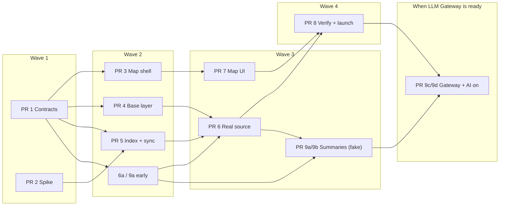

# Implementation Plan: Writers' Map — Always Ready

**Replace Waze on every destination with a map that is useful instantly:** an open-data base layer for any location, writers' pins from a pre-synced local index of the allowlisted blogs, and English AI summaries per place from a monthly job via LLM Gateway. No blog is contacted during a search or when a panel opens.

Refined October 6, 2026 (summaries replace excerpts; AI in MVP; monthly sync; caches never expire). October 7: **target output set by [the mockup](../docs/ideas/writers-map-mockup.png)**. Scope: [one-pager](../docs/ideas/community-map.md). Evidence: [overlap results](blog-overlap-results.md). Tasks: [todo.md](todo.md). Earlier plans are in git history.

## Comparison With Earlier Plans

| | Offline consensus | Live per search | Always ready, Oct 5 | **Always ready + summaries (this)** |
| --- | --- | --- | --- | --- |
| Destinations | 4 | Any | Any | **Any** |
| First search | Instant | Waits on 12 blogs | Instant writers; base ~2–3 s once | **Same** |
| Writer content | AI summaries, reviewed | Verbatim excerpts | Verbatim excerpts, on demand | **AI summary per place (English), links per writer** |
| Places with no writers | No map (Waze) | Empty map | Base pins | **Base pins** |
| Blog load | Once per regeneration | Every cold search | Weekly delta + opened panels | **Monthly sync only** |
| Stored blog text | Summaries + quotes | Excerpts | Names; excerpts ≤250 chars | **Names and positions; AI summaries** |
| Estimate | ≈61 h | ≈52 h | ≈63 h | **≈89 h** (incl. mockup UI) |

## Product Behavior
- **Search** unchanged except the map card, which loads after the page.
- **Base pins** for any location: Wikidata places of visitable types within ≈40 km (islands/regions larger); English description, Commons photo with credit, Wikipedia link.
- **Writer pins** drawn above base pins, sized by writer count. Panel: description and photo, "Mentioned by N writers", the **AI summary** (labelled) when it exists, and one link per writer's post with a language label. **No quoted blog text.**
- **Day plan layer** after "Plan my trip"; **writers' itinerary layers** from pre-parsed posts, each with **"Plan with these places"**.
- **Want to visit** in `localStorage`.
- **States:** base only ("No writer mentions here yet"), summary not available yet (links only), writer site unavailable (link still shown).

## Target Output

**The finished page should look like [the mockup](../docs/ideas/writers-map-mockup.png)** (Lisbon, desktop 1440 px and phone 375 px). Header, weather, section tabs, stays and videos already exist; the work is the map card, the panel and a richer itinerary.

**Desktop, top to bottom**
1. **Hero + weather + tabs** — exists; no change.
2. **Writers' Map card** — title, one-line subtitle, green **"Always ready"** pill (status slot).
3. **Map (≈60%) + place panel (≈40%) side by side.** Phone: map, then the panel as a card below.
4. **Layer chips on the map:** Base places · Writers' places · Summaries · My plan (numbered), and an **"All writers" filter**.
5. **Pins:** writer pins terracotta with pen icon, base pins green, plan pins numbered; big places labelled; clusters show a count.
6. **Map chrome:** zoom, north arrow, scale bar, basemap thumbnail toggle (map / satellite).
7. **Writer's walk card** bottom-left: route name, from → to, km and walking time, "View full route"; route drawn dashed.
8. **Panel:** photo with close button, name, *kind · area*, **Want to visit** (heart), writer monograms "+N · Mentioned by N writers", description, **AI summary** card, **From Travel Writers** list (post title, blog name, language chip, external-link icon, "View all (N)"), **Plan with these places** button.
9. **Plan your trip to <city>** directly under the map: dates, duration, "Generate personalized plan", **"Suggested based on writers"** theme chips.
10. **Your itinerary:** buttons View on map · Calendar export · Map export; per day: date, **temperature + condition**, km walking; stop cards with photo, number, **time slot**, tag chip (**Writers' pick**, Historic site …), **walking minutes to the next stop**.
11. **Where to stay** and **Explore through video** — exist; no change.

**Element → where it is built**

| Element | Subtask |
| --- | --- |
| Card header, "Always ready" pill, map + panel layout, map chrome | 3a, **3d** |
| Pins, labels, clusters | 7a |
| Panel (monograms, AI summary card, From Travel Writers, View all) | 7a |
| Layer chips, "All writers" filter, Summaries layer | **7f** |
| Writer's walk card and dashed route | 7c |
| Want to visit | 7d |
| Plan with these places | 7e |
| "Suggested based on writers" chips | **7h** |
| Itinerary time slots, temperature, walking minutes, Writers' pick, View on map | **7g** |
| Panel `area` and `blog_name`, GeoJSON `writers` and `has_summary`, per-day `distance_km`/`walk_minutes`, plan-stop `writers_pick` | **1e** (contract) |

**Deliberate differences from the mockup**
- **Writer avatars → initials monograms** per blog (colour from host). Blog photos are "all rights reserved".
- **Post thumbnails in "From Travel Writers" → place's Commons photo or none.** Same reason.
- **Hotel star ratings and nightly prices → not shown.** No free price source; the existing "Check prices" link stays.
- **Script overlay on the hero ("Lisbon Lives Differently") and the quoted tagline → not built.** The Wikidata description is used instead.
- **Phone bottom bar Home / Explore / Saved / Profile → keep today's section bar.** No accounts; Saved lives in the map's `saved` slot.

## Architecture Decisions
1. **Layer 1 — Wikidata nearby query, one call per destination.** SPARQL `wikibase:around`, radius ≈40 km (overrides for islands/regions), filtered to visitable classes (attractions, heritage, nature, viewpoints, museums, beaches, parks, neighbourhoods), excluding infrastructure (airports, municipalities as such). Capped at ~200 places ranked by writer count, then sitelinks. Returns QID, coordinates, en/pt labels and aliases, English description, image, sitelink count. Stored in `source_cache` **with no expiry; refreshed by the monthly run**. **It is also the gazetteer for writer matching**; Overpass is not used. Matching quality is checked in PR 2.
2. **Warm before the search.** When the search suggestions return a city, the top suggestion's base query starts in the background (throttled), so the base is usually cached before the user presses search.
3. **Layer 2 — writers index in SQLite**, created at startup with `CREATE TABLE IF NOT EXISTS`, as existing tables are:
   - `writer_posts` (host, post_id, url, title, lang, modified, is_itinerary)
   - `writer_names` (post ref, folded phrase, original-case flag, start, end): candidate place-name phrases, i.e. capitalized sequences with connectors (de/do/da/dos/das/e/of/the), and their sub-spans up to 5 words
   - `writer_days` (post ref, day number, start, end): day-heading sections
   - `writer_sync` (host, status, last_full, last_delta, cursor)

   **No post text is stored.** Raw HTML is processed in memory and dropped.
4. **Monthly job inside the web server.** A background goroutine with a single-run lock (`writer_sync`), off-peak:
   - **Initial crawl:** about 205 requests of 100 posts each.
   - **Monthly:** `modified_after` for changed posts; `_fields=id` sweep to delete posts that are gone; re-run Wikidata for cached destinations; then summaries (decision 6).
   - **Rows are updated in place** (upsert by key, no history), so the database stays bounded by the number of posts and places.
   - **Politeness:** per-host limiter at ≥1.5 s, identified user agent, robots.txt respected.
   - **Blocks and takedowns:** 403 marks the source blocked and stops it; `removed` in the allowlist purges its rows and its summaries' references.
   - **Memory:** one page in memory at a time.
5. **Search-time matching is a lookup.** Folded aliases of the destination's Wikidata places are joined against `writer_names`. Then the research rules are applied: single-word names case-sensitive, stoplist, nested-name suppression using positions, and `writerdata/overrides.json`. The result (places, writers, itineraries) is stored per destination with no expiry and recomputed after each monthly run.
6. **AI summaries via LLM Gateway (layer 3, in the MVP).** After the index update, for each place with writers whose posts changed (or that has no summary yet): fetch those posts by id through the limiter, cut the passages around each mention in memory (address/hotel/price lines skipped), send them to LLM Gateway with a fixed prompt ("2–3 sentences in English, only what the passages say"), store the result in `writer_summaries` (QID, text, source post refs, model, generated at), upserted in place.
   - **Port `Summarizer`** with a fake for tests; the gateway adapter is the only part blocked on the separate LLM Gateway project.
   - **Flag `WRITERS_AI`** gates the summary step; with it off, panels show links only.
   - **Overrides** can hide a bad summary for a QID.
   - **Cost:** LLM Gateway is the owner's own project and free to TravelTab; only Fly counts toward the US$5 cap.
7. **Map in the browser:** Leaflet (unpkg + SRI), OSM tiles with attribution, configurable tile URL, one map instance across HTMX swaps, list alternative. The day plan reaches the map through an HTMX event with stop coordinates.
8. **"Plan with these places."** The planner's `Request` gains `Include []Place` (from the writer's itinerary, max ~12); `planner.Build` seeds these into the days before filling with nearby places. The link is a normal `/plan` URL with the QIDs, so it is shareable. No frozen snapshot: day order follows today's forecast.
9. **Feature flags keep `main` releasable.** `WRITERS_MAP` (new map card; off → Waze exactly as today), `WRITERS_SYNC` (monthly job) and `WRITERS_AI` (summary step) in `config.FeatureFlags` (`internal/config/flags.go`). Every PR merges with all off; the launch PR turns on the first two; `WRITERS_AI` follows when LLM Gateway is ready.
10. **Contracts first, so agents work in parallel.** PR 1 freezes the domain types, the `WriterMapSource` and `Summarizer` ports, the GeoJSON/panel shapes, the JS extension API and a Madeira fixture with a fake source. Later PRs code against these, not against each other. Changing a contract is its own small PR.
11. **Front-end split into modules** so UI work doesn't collide: `writers-map.js` (core: map, list, layer registry, events) plus `map-panel.js`, `map-dayplan.js`, `map-itineraries.js`, `map-saved.js`. Templates expose named slots (`data-map-slot="…"`) created once in PR 3.

## Delivery: PRs and Parallel Work

**9 PRs, each mergeable on its own with CI green and flags off.** Subtasks inside a PR touch disjoint files and can go to different agents; the PR's integrator subtask owns the shared files and opens the PR. Full subtask detail: [todo.md](todo.md).

| PR | Title | Needs | Subtasks (parallel) | Est. h |
| --- | --- | --- | --- | ---: |
| **1** | Contracts, data and flags | — | 1a data + policy · 1b types + ports + contract doc · 1c fixture + fake source (after 1b) · 1d flags · **1e mockup fields** | 5 |
| **2** | Index spike (research) | — | single agent | 3 |
| **3** | Map shell behind flag | 1 | 3a core JS/CSS · 3b template + fixture endpoints · 3c preview scenario · **3d mockup layout** | 6 |
| **4** | Base layer (Wikidata) | 1 | 4a SPARQL adapter · 4b cache decorator · 4c suggestion warming | 5 |
| **5** | Writers index + monthly sync | 1, **2 verdict** | 5a tables/store · 5b extraction · 5c WordPress client + limiter · 5d sync job (integrator) | 9 |
| **6** | Matching and real source | 4, 5 | 6a matcher + itineraries · 6b real source + wiring (integrator) | 5.5 |
| **7** | Map UI features | 3 | 7a pins + panels · 7b day plan layer · 7c writers' itineraries + walk card · 7d want to visit · 7e plan with these places · **7f layer chips + writer filter** · **7g itinerary cards** · **7h writer theme chips** | 22.5 |
| **8** | Verify and launch | 6, 7 | 8a resilience tests · 8b live measurement · 8c journeys + docs · 8d flags on (owner) | 9 |
| **9** | AI summaries | 5, 6; **9c needs LLM Gateway** | 9a passage cutter · 9b summary job + store · 9c gateway adapter · 9d quality check + `WRITERS_AI` on | 9 |
| | | | **Subtotal** | **74** |
| | | | Contingency (≈20%) | 15 |
| | | | **Total** | **≈89** |

**6a and 9a are pure functions** against the PR 1 contract and fixtures: they can start right after PR 1, alongside PRs 3–5.

**PR 9 does not block launch.** 9a and 9b land with `WRITERS_AI` off and a fake summarizer; 9c starts when LLM Gateway is ready.

### Waves

**Critical path:** PR 1 → PR 5 (after the PR 2 verdict) → PR 6 → PR 8, about 29 h. PR 3, 4, 7 and 9a/9b run alongside it. **External dependency:** 9c/9d wait on the LLM Gateway project.

### Rules for Agents
- **Own only your listed files.** Shared files belong to the PR's integrator subtask: `server.go` routes, `cmd/web/main.go`, `database.go`, `map_card.go.tpl`, `env.go`, `flags.go`.
- **Cross-PR shared files:** PRs 3, 4, 5 and 9 each add a few wiring lines to `cmd/web/main.go`. Keep those edits small, one function per PR (`wireWritersMap`, `wireBaseLayer`, `wireWriterSync`, `wireSummaries`); the owner rebases on merge.
- **Contracts are frozen after PR 1.** Need a change? Stop and ask the owner for a contract PR; the owner rebases open branches.
- **One worktree and branch per subtask** (`writers-map/pr<N>-<letter>`). The integrator merges subtasks into `writers-map/pr<N>`, runs `make test lint build`, and opens the PR.
- **Tests never hit the network.** Use the PR 1 fixture, the fake source, the fake summarizer, `httptest`, and recorded responses.
- **Flags stay off** until PR 8d (`WRITERS_MAP`, `WRITERS_SYNC`) and 9d (`WRITERS_AI`). No subtask may change production behavior while the flags are off.
- **No post text stored, logged or committed.** Only names, positions and AI summaries.

## Checkpoints
- **After PR 1:** contract doc reviewed by the owner. Every later PR depends on it.
- **After PR 2:** spike verdict (index size, lookup time, precision, against proposed bars of ≤300 MB, ≤200 ms, ≥90%). **PR 5 starts only on a pass, or on a revised schema.**
- **After PR 3 + PR 7:** with `WRITERS_MAP=1`, the full UI works on fixture data in the preview.
- **After PR 6:** with both flags on locally, Madeira works end to end on real data.
- **After PR 8b:** measured numbers recorded; the owner sets targets and the launch date.
- **After PR 9d:** 20 Madeira summaries hand-checked; the owner switches `WRITERS_AI` on.

## Risks and Mitigations

| Risk | Mitigation |
| --- | --- |
| Index too large for the Fly volume | PR 2 spike gates the design; cap sub-span length; drop single-word lowercase-start phrases |
| Database grows month after month | Upsert in place, no history; deleted posts and removed hosts purged; size recorded in 8b |
| Wikidata matching worse than OSM + Wikidata | PR 2 precision check; overrides; add OSM names later if needed |
| Base pins notable but dull (airports, municipalities) | Type filter + exclusions; writer pins drawn above; cap ranked by fame |
| Wikidata Query Service slow or down | Cache never expires; warming from suggestions; map still shows tiles and day plan |
| Initial crawl bandwidth or time on Fly | One page in memory; resumable cursor; measured in PR 8b |
| LLM Gateway late | PR 9 is off the launch path; panels show links until it's ready |
| AI summaries invent or misread (esp. PT) | Passages-only prompt; 20-place hand check in 9d; *AI summary* label; per-QID hide override |
| Monthly summary run too long or too heavy | Only places whose posts changed; per-run cap; resumable |
| Wrong pins (no review) | Research matching rules, overrides, precision bar |
| Writer blocks or takedown request | 403 stops the source; `removed` purges its rows; no circumvention |
| Thin writer coverage outside Portugal | Base layer always present; expand the allowlist with global EN blogs |

## Decisions and Open Questions
- **Radius:** ≈40 km for cities, overrides for islands/regions; cap ~200 places. *Decided.*
- **Caches:** never expire; monthly refresh, updated in place. *Decided.*
- **Sync schedule:** monthly, off-peak. *Decided.*
- **Language:** English only in the UI; PT via summaries. *Decided.*
- **AI:** LLM Gateway on the server, free to TravelTab. *Decided; gateway API and readiness date open.*
- **Bloggers:** not notified before launch. *Decided.*
- **Budget:** US$5/month total. *Decided.*
- **Spike thresholds** (300 MB, 200 ms, 90%): proposed, not agreed.
- **Target date / hour budget:** not set (≈89 h estimated, of which ≈12 h is matching the mockup).
- **Look and feel:** [the mockup](../docs/ideas/writers-map-mockup.png) is the target, with the differences listed under **Target Output**. *Decided October 7, 2026.*
