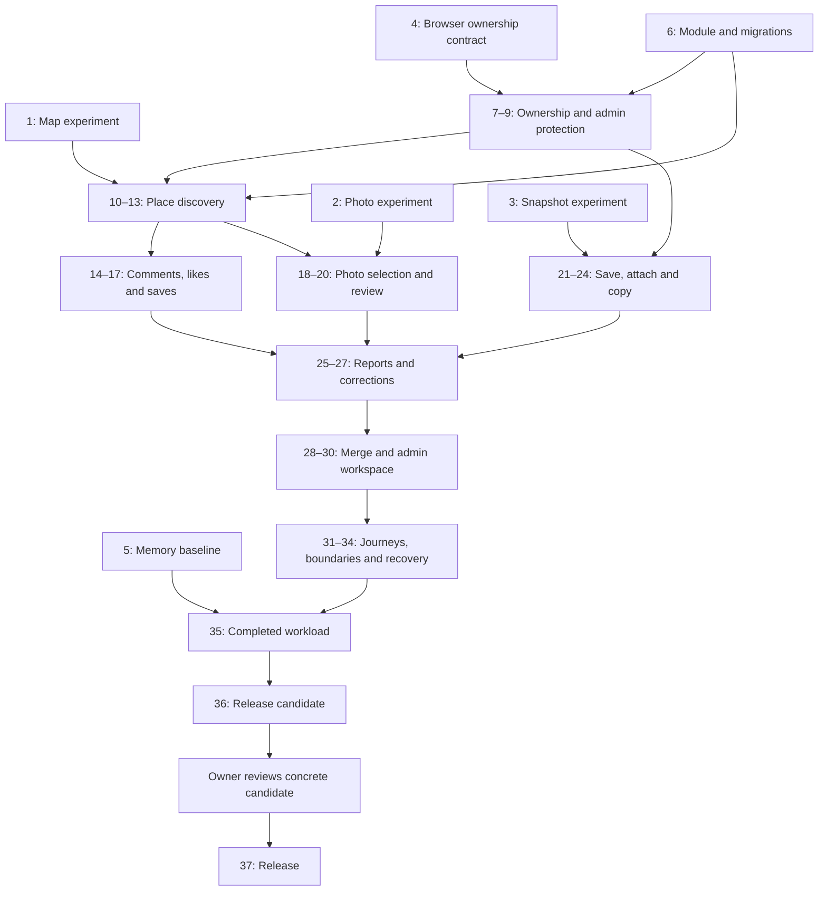

# Implementation Plan: TravelTab Community Map

## Overview

Replace the Waze iframe with a community map where visitors publish named recommendations on shared places, like places, save places to Want to visit, and attach/copy TravelTab itineraries. TravelTab supplies photos; nearby-photo selections appear immediately with a label and later admin review. There are **no public accounts or sign-in**. Anonymous visitor ownership stays in the current browser, as explicitly confirmed by the user.

Target: **October 2, 2026**, full agreed scope, **70 available hours**. Prefer free services and retain the **US$5/month goal**, but **Fly bill clarification and billing verification are excluded at the user's request**. Do not make bill investigation an implementation prerequisite or claim the ceiling is verified.

Planning only: this deliverable changes documentation, not application code. Tasks are tracked in [tasks/todo.md](todo.md). Both target files were absent at planning start; existing named plans under tasks/ remain untouched. No project instruction designates an external tracker.

## Agreed Product Behavior

- One shared pin per place; its creator posts the first contribution with a display name and text, an itinerary, or both.
- Comments/reviews publish immediately, newest first. Authors control their contributions through their browser credential. Duplicate display names are allowed and are not proof of identity.
- Place likes are limited to one per browser owner, removable, and separate from Want to visit. Without accounts this is **not enforceably one per person**; a new browser or cleared cookie can create another identity.
- Want to visit, private saved plans and copies belong to the current browser. Switching devices, clearing cookies or credential expiry loses access to personal state and author controls. Public comments remain. No recovery link or cross-device sync in this release.
- Exact-place photos take priority. If unavailable, offer supplied nearby candidates for selection; show the selected image immediately as Nearby photo and queue review. Pins can publish without any image. Users never upload photos.
- Admins can delete any comment, including comments that have never been reported, through the admin workspace. Require confirmation and a moderation reason; record the actor and time. Remove the comment and attached recommendation from public discussion while preserving the place, other comments, likes, saved places and independent itinerary copies. Authors cannot edit or restore an admin-deleted comment; generic hide/restore actions must not revive it.
- Admins also resolve reports, approve/replace/remove preview photos, change shared names/locations and merge duplicates. Approval alone does not turn a nearby photo into an exact photo.
- Published itinerary recommendations are immutable snapshots. Copies are independent private snapshots with provenance; a general route editor and direct add-place-to-itinerary action are outside scope.

## Architecture Decisions

1. **Keep Go/Fiber, HTMX and SQLite.** Follow application ports and adapter/setter injection already used by photo and planning providers. Keep community interfaces separate from the existing dashboard Storage interface to avoid forcing unrelated mocks to change.
2. **Use a small browser map module.** Leaflet is the proposed renderer; make tile URL/attribution configurable. Initialize/destroy maps on HTMX swaps and cancel stale viewport requests. Use local fixture tiles in automated checks. Normal OSM tile use must follow attribution/caching/referrer requirements and has no availability guarantee. [Leaflet](https://leafletjs.com/), [OSM tile policy](https://operations.osmfoundation.org/policies/tiles/).
3. **Use opaque anonymous ownership.** Persist a random browser credential with a hashed server-side verifier; never authorize by display name. Set a persistent HttpOnly/SameSite cookie, Secure in production. Proposed inactivity lifetime: 90 days, sliding on meaningful use; document expiry. Keep visitor state separate from admin sessions. No identity provider, password recovery or public email collection is needed.
4. **Protect admin access separately.** A configured secret verifier bootstraps the single owner/admin. Use a limited admin login with session rotation, CSRF protection and logout. This protects shared changes without requiring public sign-in.
5. **Add migrations incrementally with each slice.** Versioned, transactional migrations preserve existing cache/analytics data. Enforce ownership and unique place-like/save pairs in SQLite; use transactions for initial place/contribution creation, photo selection/review and merges.
6. **Bound reads and writes.** Viewport queries, comment lists, queues and provider requests need limits and predictable pagination. Display names/comments render as text. Shared request protection, write rate limits and server-side validation belong to each mutation, not a last-minute hardening phase.
7. **Extend existing image adapters without weakening city matching.** Reuse Commons metadata/credit parsing, but implement arbitrary-place identity and nearby candidates separately. Cache source metadata, distinguish exact versus nearby, and keep image/provider failure independent of contribution publishing. Direct embedding can fail and Commons discourages hotlinking; document the chosen delivery behavior and retain a no-photo fallback. [Commons reuse guidance](https://commons.wikimedia.org/wiki/Commons:Reusing_content_outside_Wikimedia).
8. **Capture the displayed plan before publication.** Issue a server-controlled reference to the rendered route; do not reconstruct it later from city/date parameters. Private drafts/copies and published immutable snapshots have separate access rules. Store route facts and original dates without presenting old weather as current.
9. **Make moderation and shared-place changes auditable.** Comment deletion requires admin authorization and CSRF protection, records actor/reason/time, and is idempotent. Deleted comments stay excluded from public reads and author edits, including after a duplicate merge. Merge into a selected survivor atomically, deduplicate likes/saves by browser owner, preserve contributions and review references, and redirect old place IDs. Admin changes to coordinates invalidate or re-review photo matches as appropriate.
10. **Use the existing preview and verification conventions.** Extend cmd/design-preview with temporary SQLite and fake visitor/admin contexts isolated from production. Retain existing weather, destination search, planner and export behavior.

## Conceptual Data and Route Boundaries

Introduce records incrementally, not as one oversized schema task:

| Record | Identity and invariant |
| --- | --- |
| Visitor credential | Random secret grants a browser access to its private state; display name is not a key. |
| Place | Internal stable ID, name/coordinates, optional source entity, moderation state and merge alias. |
| Contribution | Place + browser owner + display name + text and/or published snapshot reference; newest-first cursor. |
| Place like / saved place | Unique (place, visitor) pair; likes and saves are independent. |
| Photo candidate / selection | Verified provider reference, credit/license metadata, geographic relationship, selection revision and review status. |
| Saved plan / published snapshot | Versioned immutable route content; private owner or explicit public publication, plus copy provenance. |
| Report / correction / admin action | Target reference, bounded reason, resolution, actor and timestamp; no public reporter identifier. |

Proposed public routes: GET /community/places for viewport data; GET/POST /community/places/:id/contributions; GET /community/places/:id for the panel/page; POST /community/places to create. Place like/save operations use dedicated POST/DELETE routes (or explicit POST actions for ordinary forms), never GET mutations. Personal pages live under /me/places and /me/plans and require the browser credential, not a sign-in. Public published-plan pages use stable snapshot IDs. Admin routes live under /admin/community with separate authorization. Final route spellings can follow existing conventions without changing these boundaries.

## Dependency Graph

Individual task dependencies in todo.md are authoritative. Tasks use vertical feature slices after the small experimental/integration foundations. Each slice includes its storage, handler and UI responsibilities where applicable; schema edits are serialized.

## Task List

The links below are a review index. Update completion in todo.md first, then synchronize this index; do not maintain a separate tracker.

### Technical experiments

- [ ] [Task 1: Prove map interaction in the local preview](todo.md#task-1-prove-map-interaction-in-the-local-preview)
- [ ] [Task 2: Prove exact-place and nearby-photo lookup](todo.md#task-2-prove-exactplace-and-nearbyphoto-lookup)
- [ ] [Task 3: Prove immutable itinerary persistence](todo.md#task-3-prove-immutable-itinerary-persistence)

- [ ] Checkpoint: completed paths verified after Task 3.

### Ownership and integration foundation

- [ ] [Task 4: Document browser ownership behavior](todo.md#task-4-document-browser-ownership-behavior)
- [ ] [Task 5: Measure the current resource baseline](todo.md#task-5-measure-the-current-resource-baseline)
- [ ] [Task 6: Wire the optional community module](todo.md#task-6-wire-the-optional-community-module)

- [ ] Checkpoint: completed paths verified after Task 6.

### Anonymous ownership and admin protection

- [ ] [Task 7: Establish anonymous visitor ownership](todo.md#task-7-establish-anonymous-visitor-ownership)
- [ ] [Task 8: Protect the admin workspace](todo.md#task-8-protect-the-admin-workspace)
- [ ] [Task 9: Enforce visitor write boundaries](todo.md#task-9-enforce-visitor-write-boundaries)

- [ ] Checkpoint: completed paths verified after Task 9.

### Publish places on the map

- [ ] [Task 10: Let a contributor publish a place](todo.md#task-10-let-a-contributor-publish-a-place)
- [ ] [Task 11: Suggest existing nearby places](todo.md#task-11-suggest-existing-nearby-places)
- [ ] [Task 12: Replace Waze with the community map](todo.md#task-12-replace-waze-with-the-community-map)

- [ ] Checkpoint: completed paths verified after Task 12.

### Discussion and place likes

- [ ] [Task 13: Open a place discussion](todo.md#task-13-open-a-place-discussion)
- [ ] [Task 14: Let authors manage their comments](todo.md#task-14-let-authors-manage-their-comments)
- [ ] [Task 15: Like a place](todo.md#task-15-like-a-place)

- [ ] Checkpoint: completed paths verified after Task 15.

### Saved places and supplied photos

- [ ] [Task 16: Save a place for later](todo.md#task-16-save-a-place-for-later)
- [ ] [Task 17: Browse Want to visit](todo.md#task-17-browse-want-to-visit)
- [ ] [Task 18: Show supplied exact-place photos](todo.md#task-18-show-supplied-exactplace-photos)

- [ ] Checkpoint: completed paths verified after Task 18.

### Photo decisions and itinerary capture

- [ ] [Task 19: Choose a nearby preview](todo.md#task-19-choose-a-nearby-preview)
- [ ] [Task 20: Review selected photos](todo.md#task-20-review-selected-photos)
- [ ] [Task 21: Save the displayed itinerary](todo.md#task-21-save-the-displayed-itinerary)

- [ ] Checkpoint: completed paths verified after Task 21.

### Itinerary recommendations and copies

- [ ] [Task 22: Browse saved itineraries](todo.md#task-22-browse-saved-itineraries)
- [ ] [Task 23: Attach an itinerary recommendation](todo.md#task-23-attach-an-itinerary-recommendation)
- [ ] [Task 24: Copy a published itinerary](todo.md#task-24-copy-a-published-itinerary)

- [ ] Checkpoint: completed paths verified after Task 24.

### Reports and shared-place corrections

- [ ] [Task 25: Report content](todo.md#task-25-report-content)
- [ ] [Task 26: Moderate community content](todo.md#task-26-moderate-community-content)
- [ ] [Task 27: Review shared-place corrections](todo.md#task-27-review-sharedplace-corrections)

- [ ] Checkpoint: completed paths verified after Task 27.

### Duplicate merges and admin workspace

- [ ] [Task 28: Preserve data during a duplicate merge](todo.md#task-28-preserve-data-during-a-duplicate-merge)
- [ ] [Task 29: Let admins merge duplicate pins](todo.md#task-29-let-admins-merge-duplicate-pins)
- [ ] [Task 30: Expose admin navigation](todo.md#task-30-expose-admin-navigation)

- [ ] Checkpoint: completed paths verified after Task 30.

### Integrated browser and permission checks

- [ ] [Task 31: Add deterministic community journeys](todo.md#task-31-add-deterministic-community-journeys)
- [ ] [Task 32: Verify mobile map journeys](todo.md#task-32-verify-mobile-map-journeys)
- [ ] [Task 33: Verify community write boundaries](todo.md#task-33-verify-community-write-boundaries)

- [ ] Checkpoint: completed paths verified after Task 33.

### Recovery, performance and release readiness

- [ ] [Task 34: Rehearse migration and recovery](todo.md#task-34-rehearse-migration-and-recovery)
- [ ] [Task 35: Measure the completed workload](todo.md#task-35-measure-the-completed-workload)
- [ ] [Task 36: Prepare the release candidate](todo.md#task-36-prepare-the-release-candidate)

- [ ] Checkpoint: completed paths verified after Task 36.

### Reviewed release

- [ ] [Task 37: Release the reviewed community map](todo.md#task-37-release-the-reviewed-community-map)

- [ ] Checkpoint: public release verified.

## Schedule and Time Budget

The earlier **66–94-hour** assessment included public sign-in. It is historical evidence, not a measured forecast for this revised scope. Removing public accounts reduces work, but browser ownership, admin protection and recovery limitations still require implementation.

| Allocation | Hours |
| --- | ---: |
| 37 focused task timeboxes, including feature verification | 58 |
| Contingency for failures and integration fixes | 10 |
| Planning and owner review | 2 |
| **Available total** | **70** |

This allocation is an optimistic execution budget, not proof that the full idea fits. Tasks have 1–2 hour timeboxes and at most five likely files. If a timebox or file limit is exceeded, split the task, record the revised estimate and consume contingency explicitly; never hide extra work by marking incomplete criteria done.

The first five tasks allocate **7.5 hours** to map/photo/snapshot experiments, the confirmed identity contract and resource evidence. Task 6 completes the foundation checkpoint at 9 task hours. Re-estimate there before scheduling the remaining work.

Proposed cumulative task-hour checkpoints (calendar allocation may shift with the user's availability):

| Target date | Completed checkpoint | Cumulative task hours |
| --- | --- | ---: |
| September 26 | Tasks 1–6: experiments and foundation | 9 |
| September 27 | Tasks 7–12: ownership and shared places | 18 |
| September 28 | Tasks 13–18: contributions, saves and exact photos | 27.5 |
| September 29 | Tasks 19–24: nearby previews and itinerary sharing | 37.5 |
| September 30 | Tasks 25–30: moderation and merges | 47 |
| October 1 | Tasks 31–36: integration and release candidate | 56.5 |
| October 2 | Task 37: reviewed release | 58 |

Distribute the remaining 12 hours across review and fixes; do not reserve all bug fixing for release day. Missing a checkpoint triggers a revised forecast, not an automatic feature cut. The user requested the full scope by October 2.

## Verification and Checkpoints

- Every task in todo.md has at most three acceptance criteria, an affected-package test or document check, the repository build command, a manual check, dependencies and a file budget.
- Checkpoints follow every two or three tasks (three here), with an additional final release checkpoint. Record actual evidence in tasks/community-map/evidence.md and verification.md when implementation begins.
- Package tests use the existing Go test conventions. Final verification runs `go test -race -count=1 ./...`, `make lint`, `make build`, and a container startup check. Do not treat a skipped/missing tool or zero matching tests as a pass.
- Browser checks cover 375 px and 1440 px, keyboard focus, HTMX destination changes, stale requests, empty/photo-failure states, named publication, likes, saves, itinerary copying and separate admin actions.
- Integrity checks cover duplicate names, two isolated browsers, cleared credentials, unauthorized edits, CSRF, concurrent retries, stale reviews, transactional merges and preserved copies. Verify that admins can delete reported or unreported comments, non-admin deletion is rejected, stale author edits cannot revive deleted content, and deletion preserves unrelated place data and itinerary copies.
- Resource measurements use a reproducible local workload, initially 10 concurrent fixture users with bounded provider delays. Starting targets follow the existing load harness: below 1% request failures, read p95 below 500 ms and mutation p95 below 1000 ms for fixture traffic. Report real provider latency separately. Assess 512 MB with headroom under comparable Linux conditions; do not infer safe resizing from an idle process.
- Migration/recovery checks run on disposable database copies before any deployment. Existing app behavior remains a required regression check.
- Human review of this plan is required before implementation, and review of the concrete release candidate is required before production deployment. Routine intermediate checks do not require repeated permission unless a material change is needed.

## Parallelization Opportunities

- Tasks 1, 2, 3 and 5 can run independently in isolated branches/worktrees; Task 4 documents the already-confirmed decision.
- After Task 9, itinerary capture and map work can proceed separately only after shared contracts are agreed. Photo adapter work can proceed alongside community UI work.
- Serialize migration registration, cmd/web and httpserver/community.go wiring, and edits to shared place templates. Avoid simultaneous edits to place_panel.go.tpl, map JavaScript or shared navigation.
- Tasks 28–30 wait for every referenced data type. Tests can run in parallel on completed independent packages, but a merge/deployment must use the integrated revision.
- Parallel sessions reduce elapsed time only when coordination fits the same 70-hour total; they do not make the estimate automatically smaller.

## Risks and Mitigations

| Risk | Impact | Mitigation |
| --- | --- | --- |
| Arbitrary places lack usable photos | High | Early exact/nearby experiment; no-photo publication remains valid. |
| Names mistaken for verified identity | High | Names are attribution only; credentials control edits; test same-name browsers. |
| Browser credential loss | Medium | Confirmed limitation; explain it in personal-state UI; no recovery or sync promise. |
| Repeated likes using new browsers | Medium | Enforce one per browser owner and rate-limit abuse; never claim verified per-person votes. |
| Public submissions create moderation load | High | Immediate publication plus bounded writes and usable report/photo queues. |
| Regenerated plans alter recommendations | High | Server-captured versioned snapshots and independent copies, tested before UI integration. |
| Duplicate merges orphan community data | High | Transactional operation, old-ID aliases, concurrency tests and reviewable admin confirmation. |
| HTMX swaps duplicate map handlers | Medium | Lifecycle cleanup and overlapping-navigation browser checks. |
| Smaller Machine cannot support workload | High | Baseline and final measurements; no automatic Fly resize. |
| Deadline overrun | High | Early experiments, small timeboxes, explicit contingency and checkpoint re-estimation. |
| Free services unavailable or change limits | Medium | Configurable map source, cached image metadata and independent failure states. |
| US$5 ceiling remains unknown | Known limitation | Billing investigation is excluded; record uncertainty without blocking unrelated implementation. |

## Open Questions and Recorded Defaults

No further product clarification is required to write this plan. Browser-only personal state is explicitly confirmed.

Implementation experiments must establish photo coverage, actual task pace and memory requirements. The plan proposes a 90-day sliding visitor credential and conservative nearby-photo candidates within 1 km, with displayed distance and no-result fallback; validate these defaults in the early experiments without treating a nearby image as an exact match. If changing a default materially changes the user experience, surface it at the next checkpoint.

Admin secret provisioning and production deployment access will be needed during implementation/release setup, not during planning. Fly billing details are intentionally deferred and will not be requested again as part of this plan.

## Planning Completion

- [x] Read the agreed spec and relevant architecture, preview and verification conventions.
- [x] Confirmed plan.md and todo.md were absent; no unfinished plan was overwritten.
- [x] Recorded dependencies, file budgets, acceptance criteria and verification per task.
- [x] Included checkpoints, parallelization boundaries and schedule uncertainty.
- [x] Incorporated no public sign-in and confirmed browser-only personal state.
- [ ] Human has reviewed and approved this plan before implementation.
