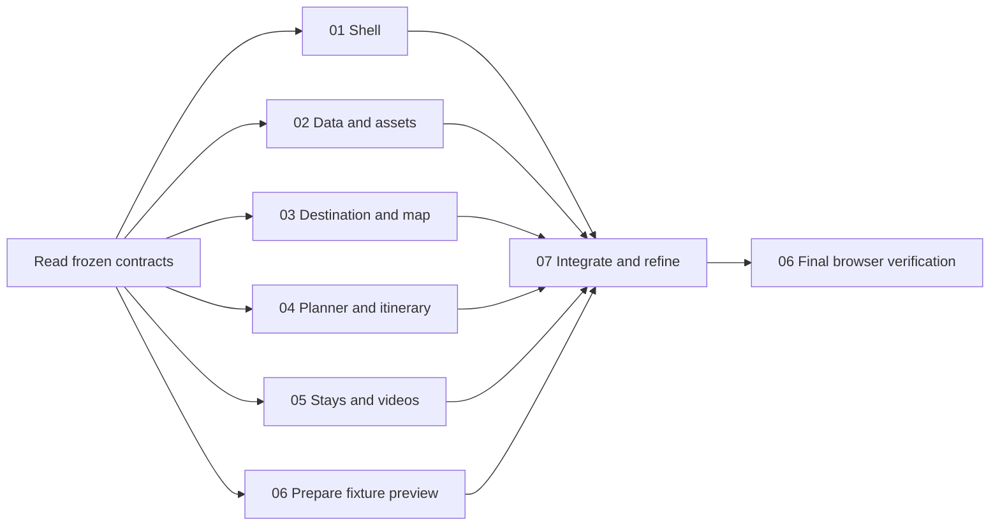

# Reference-led redesign: parallel implementation tasks

Status: tasks 01–03 implemented and verified for this milestone. Tasks 04–07 remain pending. See [milestone evidence](../artifacts/redesign/milestone-01-03/README.md) and the individual handoffs.

Read the [design plan](../../docs/redesign-plan.md), [shared contracts](contracts.md), and [reference image](../../goalimg.png) before implementing any task. The reference's central desktop page and phone screen define the visual target. The surrounding promotional poster is not website content.

## Assignment and order

| Task | Status | Ownership | Remaining dependency |
| --- | --- | --- | --- |
| [01 — Shell and visual foundation](01-shell-and-foundation.md) | Implemented | Page composition, shared tokens, header, navigation, footer | Final visual integration after 04–05 |
| [02 — Presentation data and imagery](02-presentation-data-and-assets.md) | Implemented | Go view models, handlers, curated image metadata | 04–05 consume the new view fields |
| [03 — Destination banner and map](03-destination-and-map.md) | Implemented | Hero, weather, map components | Final live-provider verification |
| [04 — Trip form and itinerary](04-planner-and-itinerary.md) | Pending | Form, accordion, plan response, planner behavior | Coordinate stay body with 05 |
| [05 — Stays and videos](05-stays-and-videos.md) | Pending | Accommodation and video cards | Uses 02 metadata |
| [06 — Fixture preview and verification](06-preview-and-verification.md) | Pending | Fixture server, browser checks, evidence | Final checks after 07 |
| [07 — Integration and visual refinement](07-integration-and-refinement.md) | Pending | Cross-component wiring and final visual consistency | 04–05 complete; 06 fixture available |

Tasks 04, 05, and fixture preparation for 06 can proceed independently. Then complete 07 and
run the final checks in 06. The existing [milestone fixture](../artifacts/redesign/milestone-01-03/README.md)
can be reused; its checks do not replace final whole-page verification.

## Collaboration rules

- Each task owns only its listed files during parallel work. Do not edit another task's file to unblock yourself; send the owner a precise request and continue independent work.
- `contracts.md` freezes template inputs, IDs, response structure, and style boundaries. The integration owner coordinates any necessary contract change with affected owners before they implement it.
- Component CSS lives in separate files. Task 01 alone edits `public/styles.css` and registers all styles/scripts in `views/index.go.tpl`.
- Avoid a shared progress file during parallel work. Each owner writes its own `handoff-NN.md` in this directory, listing changed files, checks, dependencies, screenshots if available, and outstanding limitations.
- Preserve unrelated working-tree changes, including the supplied reference image. Do not commit, publish, deploy, or rewrite unrelated functionality as part of these tasks.
- Intermediate branches may reference not-yet-delivered templates. Report this as an integration dependency; do not create competing implementations of missing components.
- Task 07 gains cross-file ownership only after 01–05 stop editing. Task 06 reports final failures to 07 for fixes; it does not concurrently modify production files.

## Definition of complete

The real application matches the reference's composition at desktop and phone sizes, uses real or explicitly absent data, and preserves search, planning, share links, exports, and booking handoffs. The fixture preview and browser evidence demonstrate behavior and appearance. All applicable checks in the design plan pass, with any inaccessible external embed recorded rather than silently counted as verified.
